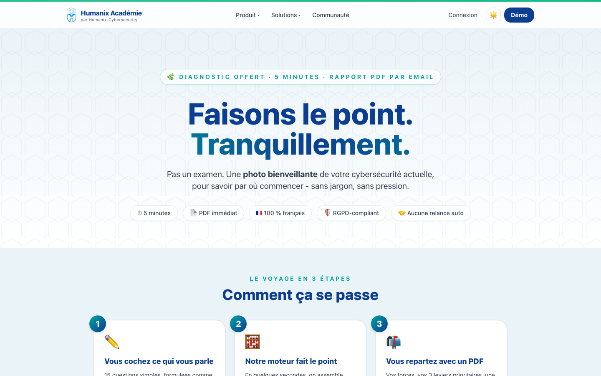
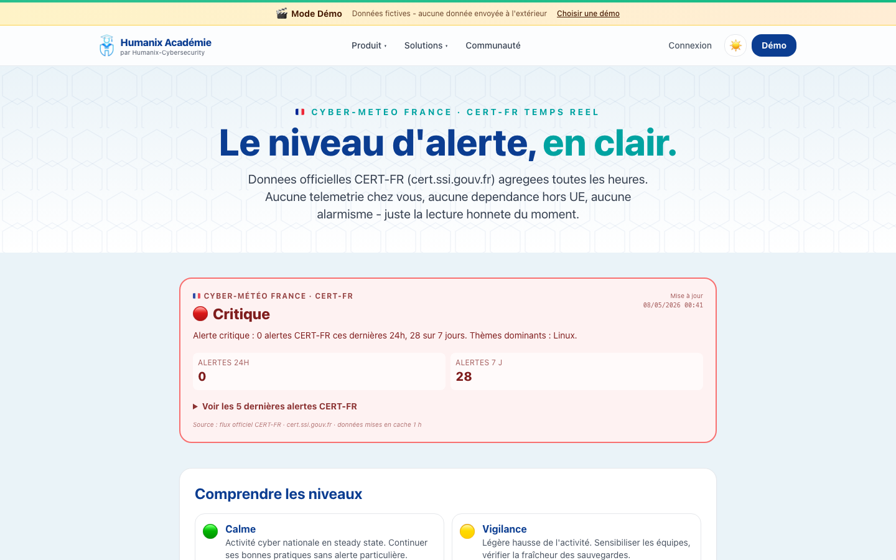
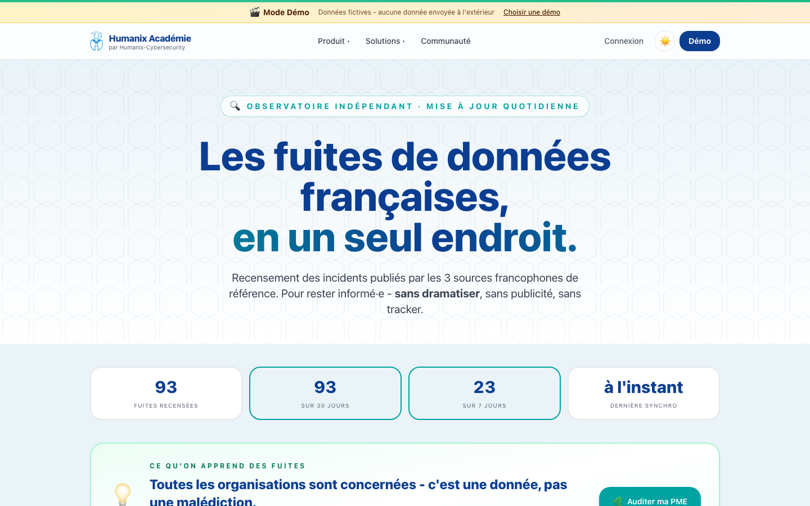
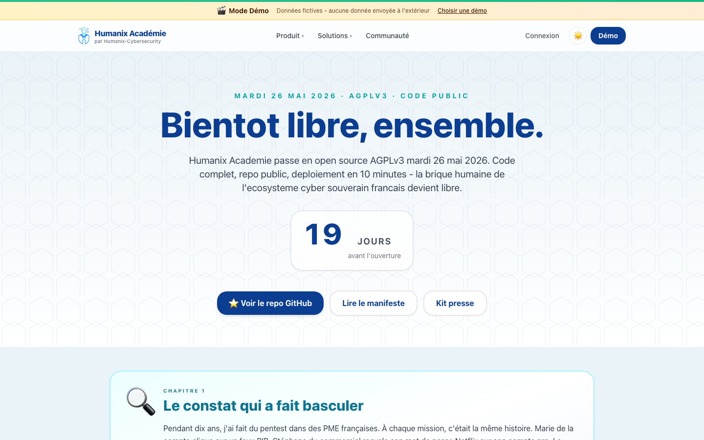

# Humanix Académie · Community Edition

> La plateforme française **open source** de cybersensibilisation pour PME.
> Code libre AGPLv3 · Hébergement souverain · Brique humaine de l'écosystème
> open source cyber souverain français.

[](https://www.gnu.org/licenses/agpl-3.0)
[](https://humanix-cybersecurity.fr)
[](https://nextjs.org)
[](https://github.com/intuitem/ciso-assistant-community)

---

## Pourquoi Humanix existe

90 % des cyberattaques contre une PME française passent par un humain. Et 90 %
des outils pour former cet humain viennent des États-Unis, sont fermés, et
coûtent 8 000 € par an et plus.

L'écosystème open source cyber français s'est structuré autour d'acteurs
reconnus — **CISO Assistant** (intuitem) pour la gouvernance, **OpenCTI**
(Filigran) pour la threat intelligence, **Wazuh** pour la détection. Mais la
couche humaine, la sensibilisation des collaborateurs, restait un trou béant.

**Humanix Académie est cette brique manquante.** Code libre AGPLv3, hébergement
souverain, intégrée nativement à CISO Assistant.

---

## En 30 secondes

- **Plateforme web Next.js** multi-tenant, gamifiée, mobile-first
- **48 modules pédagogiques experts** sur **8 saisons complètes** (phishing, mots de passe, données sensibles, télétravail, fraude-président, ransomware, IA générative, DPO-quotidien) + 18 saisons supplémentaires en fallback structuré
- **Gamification réelle** : XP, badges, mascotte évolutive, classements internes
- **Console dirigeant** : score de risque humain, rapport de conformité PDF, actions recommandées
- **Espace DPO dédié** : dashboard RGPD privé + générateur AIPD + page publique
- **MCP Server** premier mover SAT/HRM (Claude Desktop / Mistral / GPT)
- **Vishing souverain** Mistral (Paris) + TTS Voxtral (Marie 6 émotions FR) ou Piper local au choix
- **Narration audio des modules** : cache MP3 pré-rendu via `npm run tts:build`, lecture instantanée côté apprenant
- **Connecteur natif CISO Assistant** : preuves de conformité exportées automatiquement
- **Format OSCAL v1.1.2** (NIST) + CEF (Sentinel, Splunk, Sekoia, QRadar)
- **API REST** + webhooks signés HMAC-SHA256
- **Vishing + Smishing souverains** Mistral (Paris) - templates SMS/voix illimités, anti-PII automatique
- **Stack 100 % souveraine** : hébergement Scaleway Paris, email Scaleway TEM, paiement Payplug, IA Mistral
- **Sécurité défense en profondeur** : CSP strict, middleware edge sur `/admin`, DOMPurify (audit Cure53), HSTS preload, anti-SSRF whitelist, anti-PII sur prompts. Pentest interne du 7 mai 2026 : 0 critique exploité (cf. [`docs/SECURITY_AUDIT.md`](./docs/SECURITY_AUDIT.md))
- **Conformité multi-cadre** : RGPD · NIS2 · **Loi Sapin II Art. 17** (formation anti-corruption obligatoire pour les entreprises >500 salariés ou CA >100M€) · ISO 27001:2022 · ANSSI HG · NIST CSF. Mapping technique versionné dans [`lib/mapping-grc.ts`](./lib/mapping-grc.ts), export OSCAL pour CISO Assistant. Cf. [`docs/COMPLIANCE_SAPIN2.md`](./docs/COMPLIANCE_SAPIN2.md) pour le positionnement Sapin II spécifique
- **Programme de divulgation responsable** : [`/.well-known/security.txt`](https://humanix-cybersecurity.fr/.well-known/security.txt) (RFC 9116)
- **Mode démo** intégré pour tester sans installer

---

## Aperçu

| | |
|:---:|:---:|
| **Audit Cyber Flash · 5 min**<br/>Diagnostic gratuit avec rapport PDF | **Cyber-météo France · CERT-FR**<br/>Niveau d'alerte national en temps réel |
|  |  |
| **Observatoire des fuites FR**<br/>3 sources francophones agrégées | **Lancement OSS · J-19**<br/>Compte à rebours AGPLv3 |
|  |  |

---

## Démo en ligne

Teste les 3 vues principales sans installation, sans inscription :
**[humanix-cybersecurity.fr/demo](https://humanix-cybersecurity.fr/demo)**

La base de démonstration est réinitialisée régulièrement — tu peux tout
cliquer, tout modifier, tout casser sans crainte. Comptes pré-remplis pour
les rôles Apprenant, Manager et Admin.

---

## Quickstart dev local (3 minutes) ⚡

```bash
git clone https://github.com/Humanix-Cybersecurity/Humanix-Academie.git
cd humanix-academie
./scripts/start.sh
```

Le script `scripts/start.sh` détecte l'OS, installe Docker / mkcert si
absents, génère un cert TLS local trust-safe (zéro warning "site non
sécurisé"), prépare `/etc/hosts`, lance la stack en `DEMO_MODE=true`.
Ouvre **`https://humanix.local`** quand c'est terminé.

Détails : [docs/installation.md](./docs/installation.md#mode-0---quickstart-dev-avec-https-local-3-minutes-).

---

## Quickstart self-host (10 minutes)

### Prérequis

- Docker 24+ et Docker Compose v2
- 2 Go RAM minimum
- 5 Go d'espace disque
- Un nom de domaine (ou `localhost` pour tester)

### Installation

```bash
# 1. Clone le repo
git clone https://github.com/Humanix-Cybersecurity/Humanix-Academie.git
cd humanix-academie

# 2. Configure tes variables d'environnement
cp .env.example .env
# Édite .env : DATABASE_URL, AUTH_SECRET, NEXT_PUBLIC_APP_URL, etc.
# Génère un AUTH_SECRET solide :  openssl rand -base64 32

# 3. Démarre la stack (web + postgres + caddy reverse proxy)
docker compose up -d

# 4. Initialise la base de données
docker compose exec app npx prisma migrate deploy
docker compose exec app npx prisma db seed

# 5. C'est prêt
open http://localhost:3000
```

Premier compte admin : voir le log `docker compose logs app | grep "Initial admin"`.

### Documentation détaillée

- [docs/installation.md](./docs/installation.md) — installation pas-à-pas (Docker, bare-metal, Kubernetes)
- [docs/configuration.md](./docs/configuration.md) — toutes les variables d'environnement
- [docs/upgrade.md](./docs/upgrade.md) — procédure de mise à jour entre versions
- [docs/faq.md](./docs/faq.md) — questions fréquentes self-host
- [docs/TTS_VOXTRAL.md](./docs/TTS_VOXTRAL.md) — narration audio des modules (Voxtral SaaS ou Piper self-hosted)
- [docs/COMPLIANCE_SAPIN2.md](./docs/COMPLIANCE_SAPIN2.md) — couverture loi Sapin II Art. 17 (formation anti-corruption obligatoire FR)

---

## Stack technique

| Couche       | Technologie                              | Pourquoi                                         |
| ------------ | ---------------------------------------- | ------------------------------------------------ |
| Front + back | **Next.js 14** (App Router) + TypeScript | SSR + API routes dans un seul process            |
| Styling      | **Tailwind CSS**                         | Cohérence visuelle, performance, dark mode natif |
| ORM          | **Prisma**                               | Schema-first, type-safe, migrations propres      |
| Base         | **PostgreSQL 16**                        | Multi-tenant scoping, indices fins, full-text    |
| Auth         | **NextAuth.js v5**                       | SSO Google/Microsoft, magic link, RBAC           |
| Charts       | **Recharts**                             | Composants React idiomatiques                    |
| PDF          | **@react-pdf/renderer**                  | Rapports de conformité côté serveur              |
| Container    | **Docker** + Compose                     | Déploiement reproductible                        |
| TTS          | **Voxtral** (Mistral) ou **Piper** local | Narration audio des modules / vishing / articles |

---

## Narration audio (TTS) — guide express

Humanix supporte 3 backends TTS au choix selon ton contexte :

| Backend | Activation | Use case |
|---|---|---|
| **`voxtral`** (recommandé) | `TTS_PROVIDER=voxtral` + `MISTRAL_API_KEY` | Voix Marie 6 émotions FR Mistral, qualité quasi-humaine, ~$0.0001/mot |
| **`piper`** (option AGPL pure) | `docker compose --profile piper up` + `TTS_PROVIDER=piper` | Self-host total, voix `fr_FR-siwis-medium`, gratuit, RGPD strict |
| `""` (vide, défaut) | rien | Fallback Web Speech API navigateur (gratuit, qualité variable) |

```bash
# 1. Configurer (.env)
echo 'MISTRAL_API_KEY=sk-...' >> .env       # console.mistral.ai
echo 'TTS_PROVIDER=voxtral' >> .env

# 2. Pré-rendre le catalogue (idempotent, ~10 min, ~$2.50 au premier run)
docker compose exec app npm run tts:build         # 662 segments / 54 modules
docker compose exec app npm run tts:build:dry     # liste sans appel API
docker compose exec app npm run tts:build:force   # régénération totale (rare)

# 3. Hygiène cache
docker compose exec app npm run tts:prune:apply   # supprime les MP3 orphelins
                                                  # (après modif d'un MDX)
```

Où l'audio apparaît dans l'UI :
- 🔊 **Modules** (`/apprendre/<saison>/<episode>`) : bouton « Écouter le scénario / le débrief »
- 🔊 **Articles librairie** (`/librairie/<slug>`) : bouton « Écouter l'article »
- 🔊 **Cartes Cyber Famille** (`/famille`) : mini-bouton « 🔊 Aperçu » sur chaque carte
- 🔊 **Vishing admin** (`/admin/vishing`) : sélecteur de voix (Pressante / Posée / Insistante / Plaintive) + lecture du script généré

Runbook complet, voix dispo, debug : [docs/TTS_VOXTRAL.md](./docs/TTS_VOXTRAL.md).

---

## Open core — ce qui est dans ce repo, ce qui est ailleurs

Humanix Académie suit un modèle **open core**. Le code de la plateforme et 5
modules pédagogiques de base sont open source AGPLv3. Les modules pédagogiques
avancés, le phishing simulé, le Pack NIS2 turnkey et le SSO entreprise sont
proposés en cloud managé ou via une licence commerciale.

| Composant                                                          | Statut                               |
| ------------------------------------------------------------------ | ------------------------------------ |
| Plateforme Next.js (engine, dashboard, API, multi-tenant)          | Open AGPLv3 (ce repo)                |
| 5 modules de base (mots de passe, MFA, phishing, sauvegarde, RGPD) | Open AGPLv3 (ce repo)                |
| Gamification engine + mascotte                                     | Open AGPLv3 (ce repo)                |
| Connecteur CISO Assistant + format OSCAL                           | Open AGPLv3 (ce repo)                |
| Catalogue 30+ modules avancés                                      | Cloud Essentielle / Pro / Enterprise |
| Phishing simulé (templates + IA Mistral)                           | Cloud Pro / Enterprise               |
| Pack NIS2 turnkey complet                                          | Cloud Pro / Enterprise               |
| SSO SAML / SCIM enterprise                                         | Cloud Enterprise                     |

Tarifs cloud : voir [humanix-cybersecurity.fr/tarifs](https://humanix-cybersecurity.fr/tarifs).

📖 **Document de référence détaillé** : [`docs/OPEN_CORE.md`](./docs/OPEN_CORE.md) liste exhaustivement ce qui est ouvert vs ce qui est plan-gated en cloud, avec la justification économique et la position sur le fork hostile.

📝 **Tu veux contribuer un module pédagogique ?** Lis [`content/community/README.md`](./content/community/README.md) — frontmatter, workflow de review, licence CC BY-SA 4.0 sur le contenu.

---

## Écosystème — connecteurs techniques

Humanix Académie s'inscrit dans l'écosystème open source cyber souverain
français. Connecteurs techniques disponibles ou en cours
(aucun partenariat commercial signé à ce jour — les intégrations sont
techniquement prêtes côté Humanix, libre à chaque éditeur de les utiliser) :

| Outil                                                                  | Rôle                                  | Statut           |
| ---------------------------------------------------------------------- | ------------------------------------- | ---------------- |
| [CISO Assistant](https://github.com/intuitem/ciso-assistant-community) | GRC (gouvernance, risque, conformité) | Connecteur natif |
| [OpenCTI](https://github.com/OpenCTI-Platform/opencti)                 | Threat intelligence                   | Roadmap Q3 2026  |
| [Wazuh](https://github.com/wazuh/wazuh)                                | SIEM / détection                      | Format CEF       |
| [TheHive](https://github.com/TheHive-Project/TheHive)                  | Réponse à incident                    | Roadmap Q4 2026  |
| Microsoft Sentinel                                                     | SIEM cloud                            | Workbook fourni  |
| Splunk                                                                 | SIEM                                  | Format HEC + SPL |
| Sekoia.io                                                              | XDR français                          | Format CEF       |

---

## Contribuer

Toute contribution est bienvenue : code, documentation, traductions, modules
pédagogiques, retours d'expérience, signalements de vulnérabilité.

- Avant de contribuer : lis [CONTRIBUTING.md](./CONTRIBUTING.md)
- Code de conduite : [CODE_OF_CONDUCT.md](./CODE_OF_CONDUCT.md)
- Vulnérabilités : [SECURITY.md](./SECURITY.md) — disclosure responsable
- Discussions : [GitHub Discussions](https://github.com/Humanix-Cybersecurity/Humanix-Academie/discussions)
- Page communauté publique : [humanix-cybersecurity.fr/communaute](https://humanix-cybersecurity.fr/communaute)

### Ton premier PR — par où commencer

Voici les contributions les plus accessibles, classées par effort croissant :

1. **Typo / clarification doc** (10 min) — `README.md`, `docs/*.md`, ou un commentaire de code peu clair. PR directe, review légère.
2. **Module MDX pédagogique** (1-2h) — il reste **18 saisons** au catalog (`prisma/catalog-saisons.ts`) sans contenu MDX. Tu suis la grammaire des saisons existantes (`content/saisons/phishing/01-mail-du-pdg.mdx` est un bon modèle), tu écris un scénario en 5-7 minutes de lecture. Frontmatter strict, 4 choix réalistes, débrief structuré, quiz 3 questions, citation finale.
3. **Traduction** (1-3h) — les fichiers `messages/<locale>.json` sont prêts pour i18n. Anglais en priorité pour la diaspora francophone européenne.
4. **Connecteur** (1-2 jours) — un éditeur GRC ou SIEM additionnel (Drata, Vanta, ServiceNow). Modèle dans `connectors/ciso-assistant/` ou `connectors/sentinel/`. Licence MIT pour faciliter l'adoption.
5. **Module fonctionnel** (2-5 jours) — features marquées "roadmap" dans [issues GitHub](https://github.com/Humanix-Cybersecurity/Humanix-Academie/issues). RFC d'abord pour les gros morceaux.

Issues marquées **`good first issue`** sur GitHub : les plus accessibles pour un premier PR. Discord communautaire ouvre après le launch OSS du 26 mai 2026.

### Tests unitaires

La logique critique (auth, plans, billing, marketplace integrity, scoring,
SCIM, OSCAL, SIEM, webhooks HMAC, conformité GRC, audit log, email,
errors, sanitization HTML) est couverte par **446 tests unitaires Vitest**
au coverage 97-100% par fichier.

```bash
npm test                # Lance les tests une fois
npm run test:watch      # Mode watch (TDD)
npm run test:coverage   # Coverage report HTML dans ./coverage/index.html
```

Les tests tournent en CI sur chaque push/PR. Toute PR qui casse les tests
existants ou n'apporte pas de tests sur du code critique sera refusée.

**Périmètre couvert (sprint 1)** :

- `lib/audit-flash/scoring.ts` — moteur scoring audit-flash (100%)
- `lib/marketplace/integrity.ts` — hash SHA-256 modules (100%)
- `lib/marketplace/schema.ts` — validation Zod stricte (100%)
- `lib/plans.ts` + `lib/pricing.ts` — plan-gating + 6 paliers (100%)
- `lib/scim/mapper.ts` + `filter.ts` — RFC 7644 SCIM v2 (94-100%)
- `lib/webhooks/dispatcher.ts` — HMAC + SSRF guard (helpers exposés)
- `lib/webhooks/formatters.ts` — Slack/Teams payloads (97%)
- `lib/siem-formatters.ts` — Splunk CIM + ArcSight CEF (100%)
- `lib/oscal.ts` — NIST OSCAL v1.1.2 (100%)
- `lib/mapping-grc.ts` — ISO 27001 / NIS2 / RGPD / ANSSI HG (100%)
- `lib/crypto.ts` — API keys + HMAC + tokens (100%)
- `lib/levels.ts` — gamification XP (100%)
- `lib/cyber-score.ts` — score CODIR (100%)

**À venir post-launch** : breaches/parsers, ai/mistral, anecdotes,
business-impact, family-invites, incident-response, phishing/personalized,
tts. Cible globale : 80% coverage Q3 2026.

---

## Modèle économique — comment Humanix vit

La plateforme open source est **gratuite à vie** en self-host. Humanix
Cybersecurity finance le développement par les services à forte valeur ajoutée
qu'elle propose autour :

- **Cloud managé** (à partir de 0 €/mois en Découverte, 19 €/mois en Starter)
- **Audit cybersécurité** et gap analysis NIS2
- **Formation professionnelle** (intra et inter-entreprise, éligible Qualiopi)
- **RSSI externalisé** (forfait mensuel)
- **Pack NIS2 turnkey** + accompagnement à la conformité
- **Intégrations sur-mesure** (Drata, Vanta, ServiceNow, etc.)

C'est le modèle d'intuitem (CISO Assistant), Filigran (OpenCTI) et Centreon —
éprouvé en France, qui finance durablement l'open source.

**Sponsoring (à venir)** : un programme officiel via GitHub Sponsors et
Open Collective sera lancé après le launch du 26 mai 2026. D'ici là, pour
discuter d'un parrainage corporatif ou individuel, contacte
`contact@humanix-cybersecurity.fr`.

---

## Licence

Humanix Académie Community Edition est distribuée sous **GNU Affero General
Public License v3.0** (AGPLv3). Voir [LICENSE](./LICENSE) pour le texte
intégral et [COPYRIGHT](./COPYRIGHT) pour la notice de copyright.

**Implications principales** :

- Self-host gratuit, modification interne libre
- Si tu héberges Humanix en SaaS pour des tiers, tu dois **redistribuer le
  code source** (incluant tes modifications) sous AGPLv3
- Tu peux contribuer tes modifications à l'upstream pour profiter à tous

Si tu as besoin d'une **licence commerciale** (par exemple pour un produit
fermé qui embarque Humanix), contacte `contact@humanix-cybersecurity.fr` —
Humanix Cybersecurity propose un dual-licensing au cas par cas.

---

## Contact

| Sujet                     | Adresse                                                                                     |
| ------------------------- | ------------------------------------------------------------------------------------------- |
| Questions générales       | [GitHub Discussions](https://github.com/Humanix-Cybersecurity/Humanix-Academie/discussions) |
| Bugs et features          | [GitHub Issues](https://github.com/Humanix-Cybersecurity/Humanix-Academie/issues)           |
| Vulnérabilités sécurité   | security@humanix-cybersecurity.fr (voir [SECURITY.md](./SECURITY.md))                       |
| Commercial / partenariats | contact@humanix-cybersecurity.fr                                                            |
| Site web                  | https://humanix-cybersecurity.fr                                                            |

---

## Remerciements

Humanix Académie n'existerait pas sans :

- L'écosystème **open source cyber français** : intuitem, Filigran, Centreon, OVHcloud, Scaleway
- La communauté **CESIN, OSSIR, CEFCYS** pour le partage d'expérience
- Tous les **dirigeants PME** qui ont accepté d'être pilotes en phase de validation

Et toi, en lisant ce README jusqu'ici. Bienvenue.

---

_Made in France by [Humanix Cybersecurity](https://humanix-cybersecurity.fr)_
